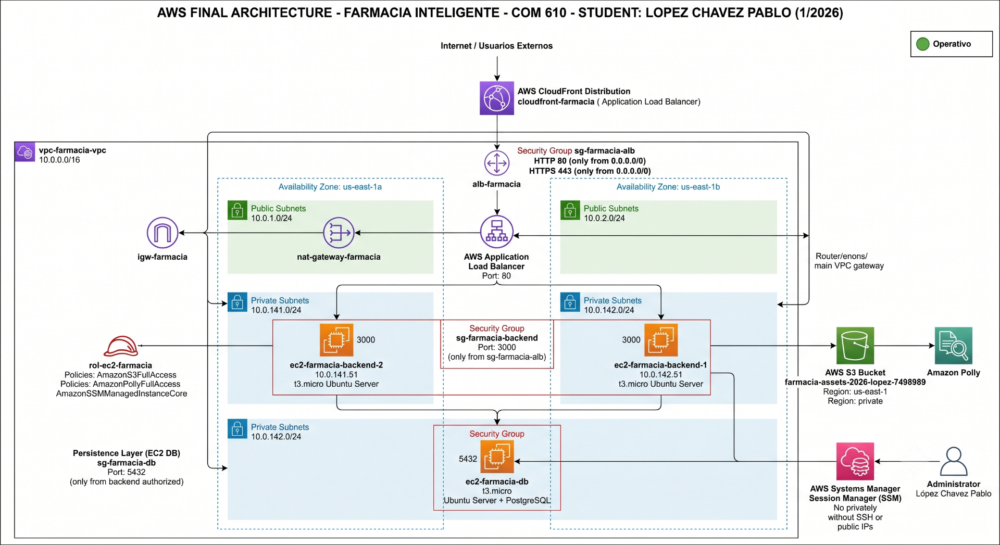

# Materia: COM 610 - Trabajando en la Nube

**Estudiante:** Lopez Chavez Pablo  
**Semestre:** 1/2026

## 1. Tabla de Infraestructura y Servicios Actualizada

La siguiente tabla describe de manera detallada el estado actual del aprovisionamiento de infraestructura en la nube de Amazon Web Services (AWS) y la arquitectura híbrida implementada para el cumplimiento de los objetivos definidos en el Segundo Parcial. La infraestructura se encuentra desplegada bajo un enfoque de alta disponibilidad, segmentación de red privada y acceso seguro a servicios internos, evitando exposición pública innecesaria de componentes críticos.

| Nombre del Componente | Rol Estratégico en la Arquitectura | Tecnología / Tipo de Recurso | IP Privada / Endpoint / Puerto | Estado Actual |
|:---|:---|:---|:---|:---|
| **vpc-farmacia-vpc** | Segmentación y aislamiento lógico de toda la infraestructura cloud. | AWS VPC Personalizada (CIDR `10.0.0.0/16`) | Bloque CIDR principal | 🟢 **Operativo** |
| **subredes-publicas** | Hospedaje de recursos expuestos a Internet y componentes perimetrales. | AWS Subnets (`us-east-1a` / `us-east-1b`) | `10.0.1.0/24`, `10.0.2.0/24` | 🟢 **Operativo** |
| **subredes-privadas** | Capa segura para procesamiento interno y persistencia de datos sin exposición pública. | AWS Subnets (`us-east-1a` / `us-east-1b`) | `10.0.141.0/24`, `10.0.142.0/24` | 🟢 **Operativo** |
| **igw-farmacia** | Gateway de conectividad para tráfico entrante y saliente hacia Internet. | AWS Internet Gateway | Asociado a `vpc-farmacia-vpc` | 🟢 **Operativo** |
| **nat-gateway-farmacia** | Permite acceso saliente a Internet desde recursos privados sin exposición directa. | AWS NAT Gateway (Elastic IP fija) | Desplegado en subred pública | 🟢 **Operativo** |
| **cloudfront-farmacia** | Red de distribución de contenido (CDN) para optimizar acceso y servir como capa de entrada global hacia el balanceador. | AWS CloudFront Distribution | Origin apuntando a `alb-farmacia` | 🟢 **Operativo** |
| **alb-farmacia** | Balanceador de carga principal y punto central de acceso para el cliente Flutter y peticiones HTTP. | AWS Application Load Balancer (ALB) | Public DNS Endpoint / Puerto `80` | 🟢 **Operativo** |
| **sg-farmacia-alb** | Firewall perimetral encargado de controlar tráfico de entrada al balanceador. | AWS Security Group | Entrada `0.0.0.0/0` → Puerto `80` | 🟢 **Operativo** |
| **sg-farmacia-backend** | Grupo de seguridad restrictivo para las instancias backend. | AWS Security Group | Entrada únicamente desde `sg-farmacia-alb` → Puerto `3000` | 🟢 **Operativo** |
| **sg-farmacia-db** | Firewall interno exclusivo para acceso a la base de datos relacional privada. | AWS Security Group | Entrada solo desde backend autorizado → Puerto `5432` | 🟢 **Operativo** |
| **ec2-farmacia-backend-1** | Nodo principal de ejecución del servicio API REST (Core 1). | AWS EC2 `t3.micro` (Ubuntu Server LTS) | `10.0.142.51` / Puerto interno `3000` | 🟢 **Operativo** |
| **ec2-farmacia-backend-2** | Nodo secundario de procesamiento para tolerancia a fallos y balanceo de carga (Core 2). | AWS EC2 `t3.micro` (Ubuntu Server LTS) | `10.0.141.51` / Puerto interno `3000` | 🟢 **Operativo** |
| **ec2-farmacia-db** | Servidor privado dedicado a persistencia relacional centralizada del sistema. | AWS EC2 Ubuntu Server + PostgreSQL | Subred privada / Puerto interno `5432` | 🟢 **Operativo** |
| **farmacia-assets-2026-lopez-7498989** | Repositorio seguro de almacenamiento de imágenes médicas, recetas y evidencia documental. | AWS S3 Bucket | Región `us-east-1` (Acceso Público Bloqueado) | 🟢 **Operativo** |
| **amazon-polly-farmacia** | Servicio de síntesis de voz para generación de audio médico y accesibilidad del sistema. | AWS Amazon Polly | Integrado mediante SDK AWS | 🟢 **Operativo** |
| **rol-ec2-farmacia** | Identidad IAM para acceso seguro entre servicios sin credenciales hardcodeadas. | AWS IAM Role & Instance Profile | `AmazonSSMManagedInstanceCore` + políticas S3 y Polly | 🟢 **Operativo** |
| **Capa de Persistencia Temporal (Live Demo)** | Infraestructura híbrida de contingencia para pruebas y continuidad operativa en demostraciones. | Docker Contenedor (`postgres:14-alpine`) | Host local conectado mediante túnel seguro | 🟢 **Operativo** |

## Consideraciones Arquitectónicas Implementadas

- La arquitectura adopta un enfoque de **segmentación de red privada**, donde las bases de datos no poseen IP pública ni acceso directo desde Internet.
- El servicio **CloudFront** fue configurado como capa de distribución y aceleración global, redirigiendo tráfico directamente hacia el **Application Load Balancer (ALB)**.
- La persistencia de datos dejó de depender de **Amazon RDS**, migrándose hacia una instancia **EC2 privada dedicada para PostgreSQL**, manteniendo el servicio dentro de la misma VPC y subred privada.
- El servicio **Amazon Polly** se encuentra completamente integrado y operativo para funcionalidades relacionadas con síntesis de voz y asistencia al usuario.
- Se mantiene una **capa híbrida temporal de contingencia** para escenarios de demostración y respaldo operativo durante pruebas controladas.

## 2\. Diagrama de arquitectura con leyenda de estado (operativo / en configuración / pendiente).




## 3. Configuración de Máquinas (Entorno EC2)

En esta sección se describe el proceso de configuración realizado sobre las instancias EC2 destinadas al despliegue del backend y la base de datos del sistema de farmacia inteligente, garantizando conectividad privada, persistencia de datos y alta disponibilidad dentro de la VPC implementada.

### 3.1 Backend

Las instancias EC2 del backend fueron configuradas para ejecutar el servicio principal de la API REST desarrollada en NestJS, permitiendo la comunicación interna con la base de datos PostgreSQL alojada en una instancia privada dentro de la misma VPC.

#### Variables de Entorno del Backend

Las siguientes variables de entorno fueron configuradas en ambas máquinas virtuales del backend para permitir la conexión segura con la base de datos relacional:

```env
DB_HOST=10.0.128.137
DB_PORT=5432
DB_USERNAME=pguser
DB_PASSWORD=Farmacia2026*
DB_DATABASE=farmacia_db
```

**Descripción de Variables:**

| Variable | Descripción |
|:---|:---|
| `DB_HOST` | Dirección IP privada de la instancia EC2 de PostgreSQL dentro de la VPC. |
| `DB_PORT` | Puerto de escucha del motor PostgreSQL. |
| `DB_USERNAME` | Usuario con permisos de acceso sobre la base de datos. |
| `DB_PASSWORD` | Contraseña de autenticación del usuario PostgreSQL. |
| `DB_DATABASE` | Base de datos principal utilizada por el sistema. |

---

### 3.2 Máquina Base de Datos (EC2 PostgreSQL)

La base de datos fue implementada en una instancia EC2 privada utilizando PostgreSQL nativo sobre Ubuntu Server, eliminando la dependencia de Amazon RDS y manteniendo el acceso únicamente dentro de la red privada de la VPC.

#### Paso 1: Actualización del Sistema e Instalación de PostgreSQL

Se actualizó el sistema operativo y se instaló PostgreSQL junto a sus componentes complementarios.

```bash
sudo apt update
sudo apt install -y postgresql postgresql-contrib
```

---

#### Paso 2: Acceso a la Consola PostgreSQL

Se ingresó al usuario administrador interno de PostgreSQL para realizar la creación de la base de datos y credenciales.

```bash
sudo -i -u postgres psql
```

---

#### Paso 3: Creación de la Base de Datos y Usuario

Dentro de la consola interactiva de PostgreSQL se ejecutaron las siguientes instrucciones SQL:

```sql
CREATE DATABASE farmacia_db;

CREATE USER pguser WITH PASSWORD 'Farmacia2026*';

GRANT ALL PRIVILEGES ON DATABASE farmacia_db TO pguser;
```

Posteriormente se salió de la consola:

```sql
\q
```

---

#### Paso 4: Configuración de Escucha de Red Privada

Para permitir conexiones desde las instancias backend dentro de la VPC, se modificó el archivo de configuración principal de PostgreSQL.

```bash
sudo nano /etc/postgresql/14/main/postgresql.conf
```

Se localizó la línea:

```conf
#listen_addresses = 'localhost'
```

Y fue modificada a:

```conf
listen_addresses = '*'
```

Esta configuración habilita la escucha de conexiones provenientes de la red privada de AWS.

---

#### Paso 5: Configuración de Acceso por Subred Privada

Se editó el archivo de autenticación de PostgreSQL:

```bash
sudo nano /etc/postgresql/14/main/pg_hba.conf
```

Se agregó la siguiente línea al final del archivo:

```conf
host    all             all             10.0.0.0/16             md5
```

Esta regla permite conexiones autenticadas mediante contraseña únicamente desde direcciones pertenecientes al rango de la VPC privada.

---

#### Paso 6: Reinicio del Servicio PostgreSQL

Una vez aplicados los cambios de configuración, se reinició el servicio:

```bash
sudo systemctl restart postgresql
```

Además, se habilitó el inicio automático al arrancar la instancia EC2:

```bash
sudo systemctl enable postgresql
```

---

#### Paso 7: Verificación del Servicio

Se verificó el correcto funcionamiento del motor PostgreSQL y su inicio automático.

**Comprobar inicio automático:**

```bash
sudo systemctl is-enabled postgresql
```

Resultado esperado:

```text
enabled
```

**Verificar estado del servicio:**

```bash
sudo systemctl status postgresql
```

Esto permite validar el estado de salud, tiempo de actividad y consumo del motor de base de datos.

---

#### Paso 8: Configuración de Permisos del Esquema Público

Se volvió a ingresar a PostgreSQL para otorgar permisos completos sobre el esquema `public` al usuario creado.

```bash
sudo -i -u postgres psql
```

Conectarse a la base de datos:

```sql
\c farmacia_db
```

Aplicar permisos:

```sql
ALTER SCHEMA public OWNER TO pguser;

GRANT ALL ON SCHEMA public TO pguser;

GRANT ALL PRIVILEGES ON ALL TABLES IN SCHEMA public TO pguser;
```

Salir de PostgreSQL:

```sql
\q
```

### Resultado de la Configuración

Con esta configuración, la base de datos PostgreSQL quedó desplegada de forma completamente privada dentro de la VPC, sin exposición pública a Internet, permitiendo únicamente conexiones internas desde las instancias backend autorizadas mediante grupos de seguridad y autenticación por credenciales.
A continuación, se detallan los comandos ejecutados secuencialmente dentro de las instancias privadas `ec2-farmacia-backend` a través de AWS Systems Manager (Session Manager) para consolidar el entorno de ejecución.

### 3.3 Máquina Backend (EC2 Backend)

Las instancias EC2 del backend fueron configuradas para ejecutar el servicio principal desarrollado en **NestJS**, utilizando **Node.js 20**, **PM2** como administrador de procesos y conexión privada hacia la base de datos PostgreSQL alojada en una instancia EC2 dentro de la misma VPC.

El backend también fue preparado para integrarse con servicios nativos de AWS, principalmente **Amazon S3** para almacenamiento de archivos médicos y **Amazon Polly** para generación de audio mediante síntesis de voz.

---

#### Paso 1: Acceso al Usuario Operativo

Al ingresar a la instancia mediante el canal seguro de AWS, se cambia al usuario operativo `ubuntu`.

```bash
sudo su - ubuntu
```

---

#### Paso 2: Instalación de Node.js 20

Se descargó e importó el repositorio oficial de NodeSource para instalar Node.js versión 20.

```bash
curl -fsSL https://deb.nodesource.com/setup_20.x | sudo -E bash -
sudo apt-get install -y nodejs
```

Verificación de instalación:

```bash
node -v
npm -v
```

---

#### Paso 3: Instalación de PM2

PM2 fue instalado de forma global para administrar la ejecución del backend en segundo plano.

```bash
sudo npm install -g pm2
```

---

#### Paso 4: Descarga del Código Fuente

Se clonó el repositorio principal del proyecto desde GitHub.

```bash
git clone https://github.com/pablolopezchavez/Farmacia-Centinela.git
cd Farmacia-Centinela
```

---

#### Paso 5: Configuración del Archivo `.env`

Se creó y editó el archivo de variables de entorno del backend.

```bash
nano .env
```

Contenido configurado:

```env
# =========================
# APP
# =========================
PORT=3000
NODE_ENV=production

# =========================
# DATABASE - EC2 PRIVADA POSTGRESQL
# =========================
DB_TYPE=postgres
DB_HOST=10.0.128.137
DB_PORT=5432
DB_USER=pguser
DB_PASSWORD=***************
DB_NAME=farmacia_db

DB_SYNCHRONIZE=true
DB_LOGGING=true

# =========================
# JWT
# =========================
JWT_ACCESS_SECRET=***************
JWT_REFRESH_SECRET=***************
JWT_ACCESS_TTL=1000s
JWT_REFRESH_TTL=1300s

# =========================
# AMAZON S3 NATIVO
# =========================
S3_REGION=us-east-1
S3_BUCKET=farmacia-assets-2026-lopez-7498989
S3_FORCE_PATH_STYLE=false

# No se configuran S3_ACCESS_KEY, S3_SECRET_KEY ni S3_ENDPOINT.
# El SDK de AWS toma los permisos directamente desde el IAM Role
# asociado a la instancia EC2.

AWS_REGION=us-east-1

# =========================
# EXTERNAL INTEGRATIONS
# =========================
MAIL_HOST=smtp.gmail.com
MAIL_PORT=465
MAIL_USER=***************
MAIL_PASS=***************

GEMINI_API_KEY=***************
GROQ_API_KEY=***************
```

---

#### Paso 6: Instalación de Dependencias

Se instalaron las dependencias definidas en el archivo `package.json`.

```bash
npm install
```

---

#### Paso 7: Compilación del Proyecto NestJS

Se compiló el proyecto para generar la carpeta `/dist`.

```bash
npm run build
```

---

#### Paso 8: Prueba Manual del Backend

Antes de dejar el servicio administrado por PM2, se ejecutó manualmente para verificar errores en caliente.

```bash
node dist/main.js
```

El backend debe quedar escuchando en:

```text
0.0.0.0:3000
```

---

#### Paso 9: Ejecución con PM2

Una vez validado el funcionamiento, se inició el backend con PM2.

```bash
pm2 start dist/main.js --name "farmacia-backend"
```

Guardar la configuración actual de procesos:

```bash
pm2 save
```

Configurar inicio automático al reiniciar la instancia EC2:

```bash
sudo env PATH=$PATH:/usr/bin /usr/lib/node_modules/pm2/bin/pm2 startup systemd -u ubuntu --hp /home/ubuntu
```

---

#### Paso 10: Monitoreo del Servicio

Ver estado del proceso:

```bash
pm2 status
```

Ver logs recientes:

```bash
pm2 logs farmacia-backend --lines 50
```

---

### 3.4 Configuración de Amazon S3 en el Backend

Para integrar el backend con **Amazon S3**, se creó el archivo de configuración `src/config/s3.config.ts`.

```ts
import { registerAs } from '@nestjs/config';

export default registerAs('s3', () => ({
  region: process.env.S3_REGION || 'us-east-1',
  endpoint: process.env.S3_ENDPOINT,
  bucket: process.env.S3_BUCKET || 'uvirtual',
  forcePathStyle: process.env.S3_FORCE_PATH_STYLE === 'true',
  accessKeyId: process.env.S3_ACCESS_KEY,
  secretAccessKey: process.env.S3_SECRET_KEY,
  presignExpiresSeconds: parseInt(
    process.env.S3_PRESIGN_EXPIRES_SECONDS || '3600',
    10,
  ),
  publicEndpoint: process.env.S3_PUBLIC_ENDPOINT,
  signEndpoint: process.env.S3_PUBLIC_ENDPOINT
    ? process.env.S3_PUBLIC_ENDPOINT.replace('/storage', '')
    : process.env.S3_ENDPOINT,
}));
```

Esta configuración permite que el sistema trabaje tanto con almacenamiento local compatible con S3, como MinIO, como con **Amazon S3 nativo**. En el entorno AWS, al no definir claves de acceso en el `.env`, el SDK utiliza automáticamente el **IAM Role** adjunto a la instancia EC2.

---

### 3.5 Configuración de Amazon Polly

Para Amazon Polly se creó el archivo `polly.config.ts`, encargado de definir la región AWS utilizada por el servicio de síntesis de voz.

```ts
import { registerAs } from '@nestjs/config';

export default registerAs('polly', () => ({
  region: process.env.AWS_REGION || 'us-east-1',
}));
```

Amazon Polly permite que el sistema genere audio a partir de texto, mejorando la accesibilidad y permitiendo respuestas auditivas dentro del flujo de la aplicación.

---

### 3.6 Verificación de Servicios AWS en el Arranque del Backend

En el archivo `src/main.ts` se implementaron verificaciones iniciales para comprobar la conexión con **Amazon S3** y **Amazon Polly** al iniciar la aplicación.

```ts
import { NestFactory } from '@nestjs/core';
import { AppModule } from './app.module';
import { setupSwagger } from './config/swagger';
import cookieParser from 'cookie-parser';
import { S3Client, ListBucketsCommand } from '@aws-sdk/client-s3';
import { PollyClient, DescribeVoicesCommand } from '@aws-sdk/client-polly';
import { ConfigService } from '@nestjs/config';
import { Logger } from '@nestjs/common/services/logger.service';

async function verifyS3Storage(app: any) {
  const logger = new Logger('S3Storage');

  try {
    const configService = app.get(ConfigService);

    const s3Options: any = {
      region: configService.get('s3.region'),
      forcePathStyle: configService.get('s3.forcePathStyle'),
    };

    const endpoint = configService.get('s3.endpoint');

    if (endpoint) {
      s3Options.endpoint = endpoint;
    }

    const accessKeyId = configService.get('s3.accessKeyId');
    const secretAccessKey = configService.get('s3.secretAccessKey');

    if (accessKeyId && secretAccessKey) {
      s3Options.credentials = {
        accessKeyId,
        secretAccessKey,
      };
    }

    const s3Client = new S3Client(s3Options);

    await s3Client.send(new ListBucketsCommand({}));

    logger.log('✅ S3/MinIO storage conectado correctamente');
  } catch (err: any) {
    logger.error('❌ S3/MinIO storage no disponible o credenciales inválidas');
    logger.error(err?.message || err);
  }
}

async function verifyPollyConnection(app: any) {
  const logger = new Logger('PollyAI');

  try {
    const configService = app.get(ConfigService);

    const region =
      configService.get('polly.region') ||
      configService.get('AWS_REGION') ||
      'us-east-1';

    const pollyClient = new PollyClient({ region });

    await pollyClient.send(
      new DescribeVoicesCommand({ LanguageCode: 'es-US' }),
    );

    logger.log('✅ Amazon Polly conectado correctamente');
  } catch (err: any) {
    logger.error('❌ Amazon Polly no disponible o faltan permisos en el IAM Role');
    logger.error(err?.message || err);
  }
}

async function bootstrap() {
  const app = await NestFactory.create(AppModule);

  app.enableCors({
    origin: true,
    credentials: true,
    methods: ['GET', 'POST', 'PUT', 'DELETE', 'PATCH', 'OPTIONS'],
    allowedHeaders: ['Content-Type', 'Authorization', 'Cookie'],
  });

  app.use(cookieParser());

  setupSwagger(app);

  await verifyS3Storage(app);
  await verifyPollyConnection(app);

  await app.listen(3000, '0.0.0.0');
}

bootstrap();
```

---

### 3.7 Funcionamiento General de la Configuración

La configuración implementada permite que el backend NestJS funcione como servicio productivo dentro de una instancia EC2 privada o controlada por grupos de seguridad. El backend escucha en el puerto `3000` y recibe tráfico únicamente desde el Application Load Balancer.

La conexión hacia PostgreSQL se realiza mediante la IP privada de la instancia EC2 de base de datos, evitando exposición pública. Asimismo, el acceso a Amazon S3 y Amazon Polly se realiza mediante el IAM Role asociado a la instancia, evitando almacenar credenciales AWS directamente en el archivo `.env`.

Con esta configuración se obtiene un entorno backend operativo, seguro y preparado para producción, con administración automática mediante PM2, integración con servicios AWS y conectividad privada hacia la capa de persistencia.
## 4. Configuración de Entornos, Red Privada y Seguridad en AWS

En esta sección se describe el proceso de configuración de la infraestructura de red, grupos de seguridad y servicios de identidad implementados dentro de Amazon Web Services (AWS), con el objetivo de garantizar aislamiento, seguridad perimetral y comunicación privada entre los componentes del sistema.

La arquitectura fue diseñada bajo el principio de **mínimo privilegio**, restringiendo el acceso únicamente a los servicios autorizados y evitando exposición pública innecesaria de recursos críticos como el backend y la base de datos.

---

### 4.1 Configuración de la Red Global (VPC)

Antes de desplegar cualquier servicio computacional, se configuró una **Virtual Private Cloud (VPC)** para segmentar toda la infraestructura en un entorno privado y controlado.

#### Procedimiento de Creación

Desde la consola de AWS:

```text
VPC → Create VPC → VPC and More
```

Se utilizó la opción **"VPC and More"**, debido a que permite automatizar la creación de subredes, gateways y tablas de ruteo necesarias para una arquitectura multi-zona.

#### Parámetros Configurados

| Parámetro | Configuración Aplicada |
|:---|:---|
| Name Tag | `vpc-farmacia` |
| IPv4 CIDR Block | `10.0.0.0/16` |
| Availability Zones (AZs) | `2` |
| Public Subnets | `2` |
| Private Subnets | `2` |
| NAT Gateway | `In 1 AZ` |

#### Diseño de la Red

La VPC fue segmentada de la siguiente forma:

**Subredes Públicas**
- Utilizadas para recursos accesibles desde Internet.
- Contienen:
  - Application Load Balancer (ALB)
  - CloudFront Origin
  - NAT Gateway

**Subredes Privadas**
- Utilizadas para servicios internos no expuestos públicamente.
- Contienen:
  - Backend NestJS
  - Base de datos PostgreSQL en EC2 privada

Configuración de subredes:

| Tipo de Subred | Rango CIDR |
|:---|:---|
| Pública AZ-1 | `10.0.1.0/24` |
| Pública AZ-2 | `10.0.2.0/24` |
| Privada AZ-1 | `10.0.141.0/24` |
| Privada AZ-2 | `10.0.142.0/24` |

#### Configuración del NAT Gateway

Se implementó un único **NAT Gateway** en una zona de disponibilidad para optimizar costos operativos.

Su propósito es permitir que las instancias privadas puedan:

- Descargar paquetes del sistema operativo.
- Instalar dependencias de Node.js.
- Actualizar repositorios del sistema.
- Consumir servicios externos necesarios.

Sin embargo, las instancias privadas **no reciben tráfico entrante desde Internet**, manteniendo el aislamiento del entorno.

---

### 4.2 Configuración de Security Groups (Firewall Perimetral)

Los **Security Groups** fueron configurados como mecanismo principal de protección de red, permitiendo únicamente el tráfico estrictamente necesario entre componentes autorizados.

Desde AWS:

```text
EC2 → Security Groups → Create Security Group
```

Se crearon los siguientes grupos de seguridad:

| Nombre del Security Group | Reglas de Entrada (Inbound Rules) | Propósito |
|:---|:---|:---|
| `sg-farmacia-alb` | HTTP (`80`) desde `0.0.0.0/0`<br>HTTPS (`443`) desde `0.0.0.0/0` | Recibe tráfico web público proveniente de los clientes. |
| `sg-farmacia-frontend` | HTTP (`80`) desde Internet o restringido al balanceador | Hospeda la interfaz web del sistema. |
| `sg-farmacia-backend` | TCP Puerto `3000` → Origen: `sg-farmacia-alb` | Restringe acceso al API NestJS únicamente desde el balanceador. |
| `sg-farmacia-db` | PostgreSQL (`5432`) → Origen: `sg-farmacia-backend` | Protege la base de datos privada y permite únicamente conexiones internas desde backend. |

#### Flujo de Seguridad Implementado

El tráfico dentro del sistema sigue el siguiente patrón:

```text
Usuario
   ↓
CloudFront
   ↓
Application Load Balancer (ALB)
   ↓
Backend NestJS (Puerto 3000)
   ↓
PostgreSQL Privado (Puerto 5432)
```

Este enfoque garantiza que:

- El backend **no tenga acceso público directo**.
- La base de datos **no tenga IP pública**.
- Solo componentes internos autorizados puedan comunicarse.

#### Política de Seguridad Aplicada

> **Regla de Oro de Seguridad Implementada:**  
> Ningún puerto del backend (`3000`) ni de la base de datos (`5432`) fue expuesto a `0.0.0.0/0`.

Esto evita ataques externos, escaneo de puertos y accesos no autorizados a componentes críticos del sistema.

---

### 4.3 Configuración de IAM Role (Acceso Seguro a Servicios AWS)

Con el objetivo de evitar el almacenamiento de credenciales sensibles dentro del código fuente o del archivo `.env`, se implementó un **IAM Role** asociado a las instancias EC2 del backend.

#### Procedimiento de Creación

Desde AWS:

```text
IAM → Roles → Create Role
```

Configuración aplicada:

| Parámetro | Valor |
|:---|:---|
| Trusted Entity | AWS Service |
| Caso de Uso | EC2 |
| Nombre del Rol | `rol-ec2-farmacia` |

#### Políticas Asociadas

Se asignaron las siguientes políticas administradas:

| Política IAM | Propósito |
|:---|:---|
| `AmazonS3FullAccess` | Permite acceso completo al bucket S3 del sistema. |
| `AmazonPollyFullAccess` | Permite sintetizar voz usando Amazon Polly. |
| `AmazonSSMManagedInstanceCore` | Administración remota segura mediante AWS Systems Manager. |

#### Beneficios de Implementar IAM Role

La utilización del rol permite:

- No almacenar credenciales AWS en GitHub.
- Evitar hardcodear `AWS_ACCESS_KEY` y `AWS_SECRET_KEY`.
- Autenticación automática desde la EC2 mediante el SDK de AWS.
- Mejorar significativamente la seguridad operacional.

De esta manera, servicios como **Amazon S3** y **Amazon Polly** funcionan automáticamente sin requerir claves manuales dentro del backend.

---

### 4.4 Configuración del Almacenamiento Amazon S3

El almacenamiento de archivos médicos, imágenes de recetas y evidencia visual del sistema fue implementado mediante **Amazon S3**.

#### Procedimiento de Creación

Desde AWS:

```text
Amazon S3 → Create Bucket
```

Configuración aplicada:

| Parámetro | Configuración |
|:---|:---|
| Bucket Name | `farmacia-assets-2026-lopez-7498989` |
| Región | `us-east-1 (N. Virginia)` |
| Acceso Público | Bloqueado |
| Versioning | Deshabilitado |
| Encryption | Predeterminada AWS |

#### Funcionalidad Implementada

El bucket fue utilizado para almacenar:

- Fotografías de medicamentos.
- Imágenes de recetas médicas.
- Archivos multimedia del sistema.
- Recursos auxiliares utilizados por el backend.

El acceso al bucket se realiza mediante el SDK de AWS desde el backend NestJS, utilizando el **IAM Role de la instancia EC2**, eliminando completamente la necesidad de credenciales manuales.

---

### 4.5 Arquitectura de Seguridad Final

La arquitectura final implementada sigue el siguiente esquema de aislamiento:

```text
Internet
    ↓
CloudFront CDN
    ↓
Application Load Balancer (80/443)
    ↓
Backend EC2 Privado (Puerto 3000)
    ↓
PostgreSQL EC2 Privado (Puerto 5432)
```

Este diseño permite:

- Alta disponibilidad mediante múltiples zonas de disponibilidad.
- Segmentación entre recursos públicos y privados.
- Protección de la capa de persistencia.
- Integración segura con servicios AWS.
- Reducción de superficie de ataque del sistema.

Como resultado, el sistema queda desplegado bajo una arquitectura cloud híbrida, segura y alineada con buenas prácticas de infraestructura empresarial en AWS.
## 5. Levantamiento de Instancias Backend EC2

En esta fase se realizó el despliegue de las instancias EC2 encargadas de ejecutar el backend del sistema de farmacia inteligente. La arquitectura fue diseñada bajo un enfoque de **seguridad reforzada**, evitando completamente la exposición pública de servidores mediante direcciones IP públicas o acceso SSH tradicional.

Para lograrlo, se utilizó **AWS Systems Manager Session Manager**, permitiendo administración remota segura desde el navegador sin necesidad de abrir puertos de administración.

---

### 5.1 Configuración del Acceso Seguro mediante IAM y Session Manager

Debido a que las instancias backend fueron desplegadas dentro de **subredes privadas**, no fue posible utilizar acceso SSH convencional desde equipos externos.

En su lugar, se configuró **AWS Systems Manager (SSM)**, permitiendo acceso remoto seguro directamente desde la consola de AWS.

#### Procedimiento de Configuración

Desde AWS:

```text
IAM → Roles → rol-ec2-farmacia
```

Posteriormente:

```text
Agregar permisos → Adjuntar políticas
```

Se añadió la siguiente política administrada:

```text
AmazonSSMManagedInstanceCore
```

#### Propósito de la Configuración

Esta política permite:

- Acceso remoto seguro desde el navegador.
- Administración de servidores sin SSH.
- Eliminación de llaves `.pem`.
- Cero apertura del puerto `22`.
- Cumplimiento del modelo de infraestructura privada.

#### Beneficios de Seguridad

La implementación de **Session Manager** permitió mantener:

- **0 IP pública en backend**
- **0 acceso SSH externo**
- **0 exposición de credenciales privadas**
- Administración completamente controlada desde AWS.

---

### 5.2 Creación de las Instancias Backend

Se desplegaron **dos instancias EC2 redundantes** para garantizar tolerancia a fallos y distribución de carga mediante el Application Load Balancer (ALB).

#### Configuración General de las Instancias

| Parámetro | Configuración Aplicada |
|:---|:---|
| Tipo de Instancia | `t3.micro` |
| Sistema Operativo | Ubuntu Server `24.04 LTS` |
| Cantidad de Instancias | `2` |
| Arquitectura | Backend redundante |
| Puerto de Aplicación | `3000` |
| Framework Ejecutado | NestJS |

---

### 5.3 Procedimiento de Lanzamiento

Desde AWS:

```text
EC2 → Launch Instance
```

Se configuraron los siguientes parámetros.

---

#### 1. Nombre de las Instancias

Las instancias fueron nombradas de la siguiente forma:

| Instancia | Función |
|:---|:---|
| `ec2-farmacia-backend-1` | Nodo Backend Principal |
| `ec2-farmacia-backend-2` | Nodo Backend Secundario |

En el campo **Number of Instances** se configuró:

```text
2
```

Esto permitió desplegar ambas máquinas utilizando una configuración homogénea.

---

#### 2. Selección del Sistema Operativo

Se seleccionó la imagen oficial:

```text
Ubuntu Server 24.04 LTS
```

Debido a:

- Estabilidad para entornos productivos.
- Compatibilidad con Node.js.
- Soporte prolongado (LTS).
- Compatibilidad con PM2 y NestJS.

---

#### 3. Configuración de Red

En la sección:

```text
Network Settings → Edit
```

Se aplicaron los siguientes parámetros:

| Configuración | Valor Aplicado |
|:---|:---|
| VPC | `vpc-farmacia-vpc` |
| Backend 1 | Subred Privada AZ-1 |
| Backend 2 | Subred Privada AZ-2 |
| Public IP | `Disable` |
| Firewall | Security Group Existente |

#### Configuración de Subredes

Distribución implementada:

| Instancia | Zona de Disponibilidad | Tipo de Subred |
|:---|:---|:---|
| `backend-1` | `us-east-1a` | Privada |
| `backend-2` | `us-east-1b` | Privada |

Esta separación permitió implementar un esquema de **alta disponibilidad multi-zona**.

---

#### 4. Configuración de Seguridad (Security Group)

Se seleccionó el grupo de seguridad previamente creado:

```text
sg-farmacia-backend
```

Este grupo de seguridad fue configurado para aceptar únicamente tráfico proveniente del balanceador.

#### Regla Aplicada

| Puerto | Protocolo | Origen |
|:---|:---|:---|
| `3000` | TCP | `sg-farmacia-alb` |

Como resultado:

- El backend **no acepta tráfico desde Internet**.
- Solo el ALB puede comunicarse con la API.
- Se evita acceso directo al servicio NestJS.

---

#### 5. Configuración del Perfil IAM

En:

```text
Advanced Details → IAM Instance Profile
```

Se seleccionó:

```text
rol-ec2-farmacia
```

Este rol fue asociado para habilitar acceso seguro a:

- Amazon S3
- Amazon Polly
- AWS Systems Manager (SSM)

Sin necesidad de almacenar credenciales AWS dentro del proyecto.

---

### 5.4 Arquitectura Final del Backend

La distribución final quedó estructurada de la siguiente forma:

```text
Internet
    ↓
CloudFront
    ↓
Application Load Balancer
    ↓
┌───────────────────────┐
│ ec2-farmacia-backend-1 │
│      NestJS :3000      │
└───────────────────────┘
            │
            │
┌───────────────────────┐
│ ec2-farmacia-backend-2 │
│      NestJS :3000      │
└───────────────────────┘
            ↓
 PostgreSQL EC2 Privada
```

Ambas instancias backend ejecutan el servicio NestJS escuchando en:

```text
Puerto 3000
```

Y reciben tráfico únicamente desde el **Application Load Balancer (ALB)**.

---

### 5.5 Resultado del Despliegue

Como resultado del proceso de levantamiento:

- Se desplegaron **dos servidores backend redundantes**.
- Ambas instancias quedaron en **subredes privadas**.
- Se eliminó completamente el uso de **SSH público**.
- Se utilizó **AWS Session Manager** como mecanismo de administración segura.
- El backend quedó protegido mediante **Security Groups cruzados**.
- El sistema quedó preparado para balanceo de carga y tolerancia a fallos.

Esta implementación permitió cumplir con una arquitectura cloud segura, privada y alineada con buenas prácticas de despliegue empresarial en AWS.
## 6. Posibles Mejoras y Escalabilidad de la Arquitectura

Aunque la infraestructura implementada cumple los requerimientos funcionales y de seguridad establecidos para el presente proyecto, existen diversas mejoras tecnológicas que podrían aplicarse para aumentar la escalabilidad, automatización y rendimiento general del sistema.

---

### 6.1 Implementación de CloudFront para Recursos de Amazon S3

Actualmente, los archivos multimedia del sistema, tales como imágenes de medicamentos, recetas médicas y archivos auxiliares, son almacenados directamente en un bucket de Amazon S3.

Como mejora arquitectónica, se propone incorporar una **segunda distribución de Amazon CloudFront**, dedicada exclusivamente a servir contenido estático desde S3.

#### Arquitectura Propuesta

```text
Usuario
   ↓
CloudFront (CDN de Imágenes)
   ↓
Amazon S3
```

#### Beneficios Técnicos

La implementación permitiría:

- Reducción del tiempo de carga de imágenes.
- Cacheo distribuido globalmente.
- Menor latencia de acceso.
- Reducción de llamadas directas a S3.
- URLs más limpias y fáciles de consumir desde Flutter o frontend web.

Ejemplo:

**Actualmente:**

```text
https://bucket-name.s3.amazonaws.com/recetas/imagen1.jpg
```

**Arquitectura Mejorada:**

```text
https://cdn-farmacia.cloudfront.net/recetas/imagen1.jpg
```

Además, CloudFront permitiría aplicar:

- Compresión automática.
- Caché inteligente.
- Reglas de expiración.
- Protección de contenido mediante URLs firmadas.

---

### 6.2 Implementación de Despliegue Continuo (CI/CD)

Actualmente, el despliegue del backend requiere acceso manual a las instancias EC2 para actualizar el código, instalar dependencias y reiniciar el servicio mediante PM2.

Como mejora futura, se propone implementar un sistema de **Integración Continua y Despliegue Continuo (CI/CD)**.

#### Arquitectura Propuesta

```text
GitHub Repository
        ↓
GitHub Actions
        ↓
AWS CodeDeploy / SSH Seguro / SSM
        ↓
EC2 Backend 1
EC2 Backend 2
```

#### Flujo de Funcionamiento

Cada vez que se realice un `push` o `merge` a la rama principal:

1. GitHub Actions ejecutaría pruebas automáticas.
2. El proyecto NestJS sería compilado automáticamente.
3. Se desplegaría el código en las instancias EC2.
4. PM2 reiniciaría el backend sin intervención manual.

#### Beneficios Técnicos

Esta mejora permitiría:

- Automatización completa del despliegue.
- Eliminación de errores humanos.
- Actualizaciones más rápidas.
- Menor tiempo de indisponibilidad.
- Mayor productividad del desarrollo.

Ejemplo de proceso automatizado:

```bash
git push origin main
```

Y automáticamente:

```text
Build → Deploy → Restart PM2 → Servicio Actualizado
```

---

### 6.3 Escalado Automático de Backend (Auto Scaling)

Actualmente se utilizan dos instancias backend estáticas.

Como mejora futura, podría implementarse un **Auto Scaling Group**, permitiendo crear o destruir instancias automáticamente según el consumo de CPU, RAM o tráfico.

#### Beneficios

- Mayor tolerancia a picos de usuarios.
- Optimización de costos.
- Alta disponibilidad automatizada.
- Recuperación ante fallos.

Ejemplo:

```text
Alta carga de usuarios
        ↓
AWS crea automáticamente nuevas EC2
        ↓
ALB distribuye el tráfico
```

---

### 7.4 Migración a Contenedores Docker

Actualmente el backend se ejecuta mediante PM2 sobre Ubuntu Server.

Una mejora futura sería contenerizar el sistema utilizando **Docker**, permitiendo mayor portabilidad y consistencia entre entornos.

#### Beneficios

- Despliegues reproducibles.
- Configuración consistente.
- Mejor administración de dependencias.
- Integración simplificada con CI/CD.

---

### 7.5 Monitoreo y Observabilidad Avanzada

Se propone integrar herramientas de monitoreo como:

- **Amazon CloudWatch**
- **AWS X-Ray**
- **Grafana**
- **Prometheus**

Para supervisar:

- Uso de CPU.
- Consumo de memoria.
- Tiempo de respuesta API.
- Errores de backend.
- Estado de PostgreSQL.

Esto permitiría detectar incidentes antes de afectar a los usuarios.

---

### Resultado Esperado de las Mejoras

La aplicación de estas mejoras permitiría evolucionar el sistema desde una arquitectura funcional académica hacia una infraestructura empresarial altamente escalable, automatizada y resiliente, preparada para entornos de producción con alta concurrencia.
## 7. Conclusiones

Durante el desarrollo del presente proyecto se logró diseñar, desplegar y configurar una arquitectura cloud híbrida utilizando servicios de Amazon Web Services (AWS), aplicando principios de seguridad, segmentación de red y alta disponibilidad.

La implementación permitió construir un entorno productivo compuesto por múltiples capas de infraestructura, incluyendo balanceo de carga, backend distribuido, almacenamiento en la nube, servicios de inteligencia artificial y persistencia relacional privada.

Entre los principales resultados obtenidos se destacan los siguientes:

### 7.1 Infraestructura Segura y Segmentada

Se implementó una arquitectura basada en **subredes públicas y privadas**, evitando la exposición directa del backend y de la base de datos hacia Internet.

El acceso al sistema fue restringido mediante **Security Groups cruzados**, permitiendo únicamente comunicación autorizada entre servicios internos.

Asimismo, se eliminó el uso de acceso SSH tradicional, reemplazándolo por **AWS Systems Manager Session Manager**, incrementando significativamente la seguridad operacional.

---

### 7.2 Implementación Exitosa de Servicios AWS

Se integraron correctamente servicios administrados de AWS, tales como:

- **Amazon S3**, utilizado para almacenamiento seguro de archivos médicos.
- **Amazon Polly**, implementado para síntesis de voz y generación de audio.
- **CloudFront**, utilizado como capa de distribución global del sistema.
- **IAM Roles**, permitiendo autenticación segura sin almacenar credenciales sensibles.

La utilización de roles IAM permitió eliminar el hardcoding de credenciales, alineando la arquitectura con buenas prácticas de seguridad cloud.

---

### 7.3 Alta Disponibilidad del Backend

Se desplegaron múltiples instancias EC2 backend distribuidas en diferentes zonas de disponibilidad, permitiendo tolerancia a fallos y balanceo de tráfico mediante un **Application Load Balancer (ALB)**.

Este enfoque incrementa la resiliencia del sistema ante posibles interrupciones de infraestructura.

---

### 7.4 Persistencia de Datos Privada

La base de datos PostgreSQL fue desplegada sobre una instancia EC2 privada dentro de la misma VPC, eliminando exposición pública y garantizando comunicación interna únicamente mediante IP privada.

Esto permitió mantener una arquitectura de datos más segura y controlada.

---

### 7.5 Aprendizajes Obtenidos

El proyecto permitió adquirir experiencia práctica en:

- Diseño de arquitecturas cloud.
- Configuración de redes privadas en AWS.
- Implementación de grupos de seguridad.
- Gestión de servicios EC2.
- Integración con servicios administrados AWS.
- Automatización de despliegues backend.
- Aplicación de buenas prácticas de seguridad en la nube.

Asimismo, se comprendió la importancia de la segmentación de red, la administración de permisos mínimos y la reducción de superficie de ataque en aplicaciones desplegadas en producción.

---

### Conclusión General

Se concluye que la infraestructura implementada logró satisfacer los requerimientos técnicos del sistema de farmacia inteligente, proporcionando un entorno seguro, funcional y escalable para la ejecución de servicios backend, almacenamiento de recursos multimedia y gestión de datos clínicos.

La arquitectura desarrollada constituye una base sólida para futuras mejoras relacionadas con automatización, escalabilidad y optimización de rendimiento, permitiendo evolucionar hacia una solución cloud de nivel empresarial.